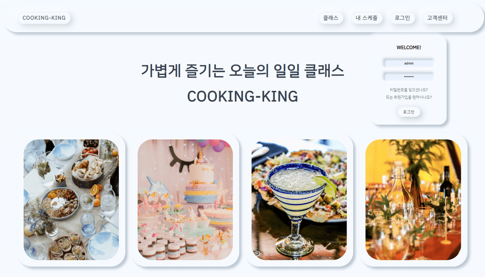
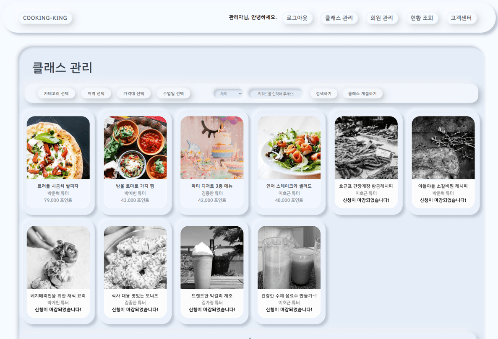

# 프로젝트명
쿠킹킹( Cook king king)

## 개요
Cookingking (요리 강좌를 수강하기 위해 멘토-멘티 연결 서비스)

## 수행 기간

2020년 07월 ~ 2020년 08월

## 개발 환경

> **OS :** Windows 10 
> **WAS :** Apache Tomcat 8.5 
> **Dababase :** Oracle 11g 
> **Language :** Java, HTML5, CSS3, JavaScript, SQL 
> **IDE :** Eclipse, SQL Developer 

## 핵심 기능

### 사용자 기능

- 사용자 유형 (관리자, 판매자, 구매자) 별 맞춤형 기능 제공
- 수강신청과 일정관리 메뉴가 유기적으로 결합된 UI/UX 화면 제공
- 다양한 검색 조건(카테고리/지역/수업일/가격대/키워드) 을 통해 빠른 데이터 접근이 가능하도록 한다.
- 캘린더를 이용한 강의 스케쥴 조회 및 관리
- 강사 이력서 및 리뷰, 평점 관리. 
- 강사 강의 횟수 집 평점에 따른 등급 반영
- 유저들의 포인트 충전, 결제, 환급 기능 제공
-  유저 문의/답변 및 공지사항 게시판 제공

### 관리자 기능

- 전체적인 메뉴 관리가 가능한 총괄 관리 페이지 제공
- 활동/비활동 회원 정보 및 포인트 출력 및 환불
- 신청 중 / 마감된 강의에 대한 분류 조회 가능
- 튜터 권한 허가/비허가
- 비정상 서비스 이용자에 대해 강제 탈퇴 기능 제공

### 주요 화면 소개

  
  
  
  

### 테이블 설계
  
